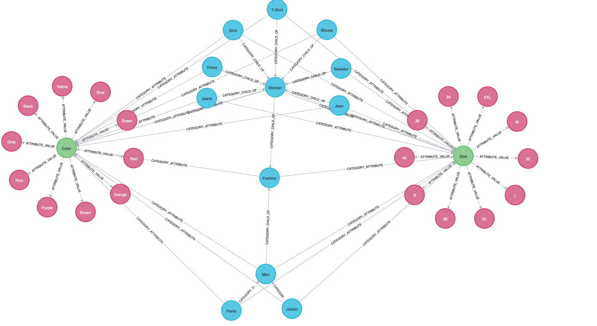

## Neo4j Spring Boot project

Project Goal:

To develop a robust and efficient web service for personal development purposes,
leveraging the powerful combination of Neo4j, a graph database, and Spring Boot, a versatile
Java-based framework.
The primary objective is to model and manage data related to categories and attributes in a seamless
and organized manner.

Project written with java 21 + Spring Boot 3.2.1 Tech:
<b>

- Neo4j
- Redis
- Docker (with Volumes)
- Open Api
  </b>

Build :

1. With Docker :

- Compile project with Java 21
- Run with Docker comments , go to project folder and run this commands:

  ```
  $ cd neo4j_SpringBoot
  $ docker build -t neo4j-spring-boot-image . 
  $ cd .. 
  $ docker-compose -f docker-compose.yaml up -d
  ```

Graph Arch.

